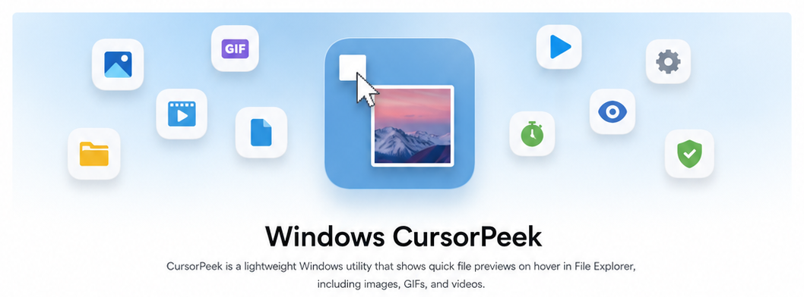
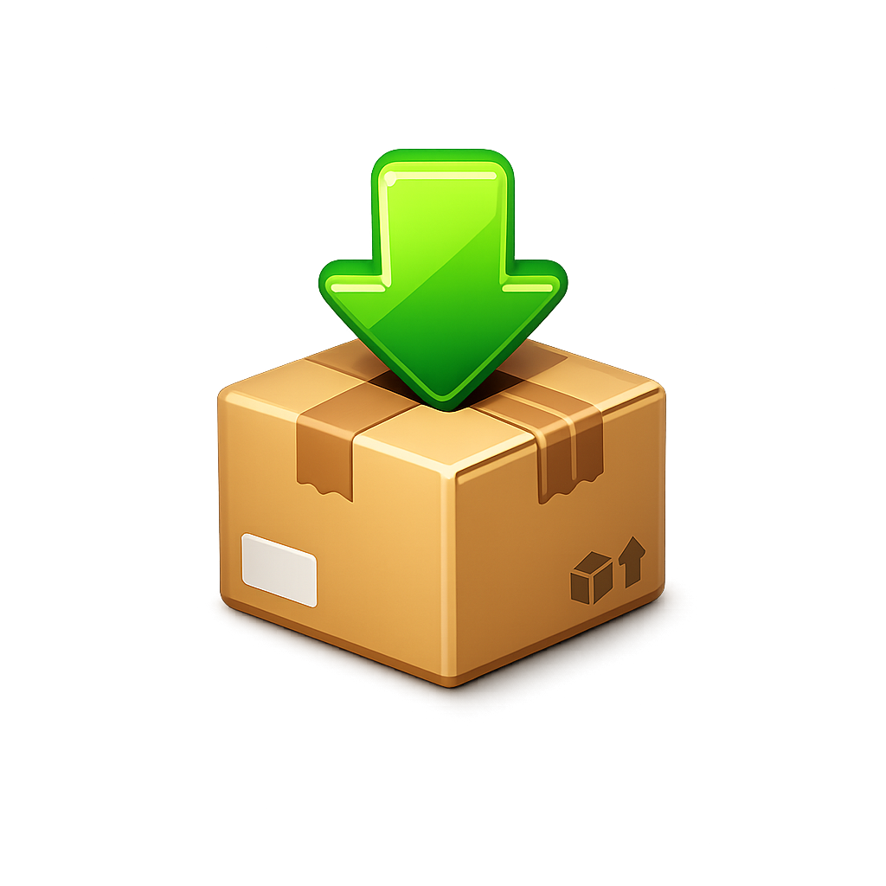
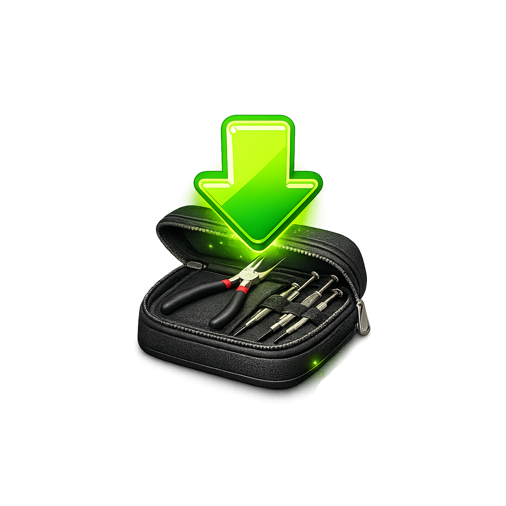
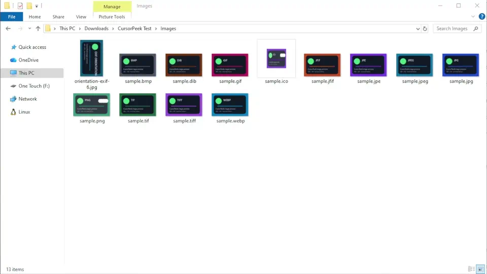
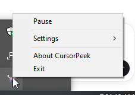

<p align="center">
  <picture>
    <source
      media="(prefers-color-scheme: dark)"
      srcset="./assets/readme/CursorPeek_banner_dark.png"
    />
    <source
      media="(prefers-color-scheme: light)"
      srcset="./assets/readme/CursorPeek_banner_white.png"
    />
    
  </picture>
</p>

<p align="center">
  <strong>Native</strong> · <strong>Offline</strong> · <strong>No account</strong> ·
  <strong>No shell extension</strong>
</p>

<p align="center">
  <picture>
    <source
      media="(prefers-color-scheme: dark)"
      srcset="./assets/readme/CursorPeek_divider_dark.svg"
    />
    <source
      media="(prefers-color-scheme: light)"
      srcset="./assets/readme/CursorPeek_divider_light.svg"
    />
    
  </picture>
</p>

<h3 align="center">
  <a href="#-installation">Installation</a>
  <span> · </span>
  <a href="docs/USER_GUIDE.md">Documentation</a>
  <span> · </span>
  <a href="https://github.com/lownamlee/CursorPeek/releases">Release notes</a>
  <span> · </span>
  <a href="https://github.com/lownamlee/CursorPeek/issues">Issues</a>
</h3>

<p align="center">
  <a href="https://github.com/lownamlee/CursorPeek/releases/latest">
    
  </a>
  <a href="https://github.com/lownamlee/CursorPeek/actions/workflows/windows-quality.yml">
    
  </a>
  <a href="#-license">
    
  </a>
</p>

## 📦 Installation

Requires Windows 10 22H2 x64 or supported Windows 11 x64 with Windows File Explorer.

<table>
  <tr>
    <td align="center" width="50%">
      <a href="https://github.com/lownamlee/CursorPeek/releases/latest/download/CursorPeek-0.2.2-windows-x64-setup.exe">
        
      </a>
      <br />
      <strong>Per-user installer</strong>
      <br />
      <sub>Recommended · installs without administrator elevation</sub>
      <br /><br />
      <a href="https://github.com/lownamlee/CursorPeek/releases/latest/download/CursorPeek-0.2.2-windows-x64-setup.exe">
        
      </a>
    </td>
    <td align="center" width="50%">
      <a href="https://github.com/lownamlee/CursorPeek/releases/latest/download/CursorPeek-0.2.2-windows-x64-portable.zip">
        
      </a>
      <br />
      <strong>Portable ZIP</strong>
      <br />
      <sub>Extract the archive and run CursorPeek.exe</sub>
      <br /><br />
      <a href="https://github.com/lownamlee/CursorPeek/releases/latest/download/CursorPeek-0.2.2-windows-x64-portable.zip">
        
      </a>
    </td>
  </tr>
</table>

> [!NOTE]
> Packages are not code-signed yet. Windows may show an unknown-publisher warning. Check downloads
> against the published [SHA256 hashes](https://github.com/lownamlee/CursorPeek/releases/latest/download/SHA256SUMS.txt).

See the [user guide](docs/USER_GUIDE.md#installed-and-portable-settings) for startup, portable
settings, and uninstall details.

## 🚀 Quick start

1. Run `CursorPeek.exe`.
2. Rest the pointer over a supported file in File Explorer.
3. Move off the file to dismiss the preview; right-click the tray icon for controls.

<p align="center">
  
</p>

## 🗂️ Supported files

| Type | Supported extensions or filenames |
| --- | --- |
| **Images** | `.jpg`, `.jpeg`, `.jpe`, `.jfif`, `.png`, `.gif`, `.webp`, `.bmp`, `.dib`, `.ico`, `.tif`, `.tiff` |
| **Text, logs, and markup** | `.txt`, `.text`, `.log`, `.md`, `.markdown`, `.mdx`, `.rst`, `.adoc`, `.tex`, `.svg` |
| **Data and configuration** | `.csv`, `.tsv`, `.json`, `.jsonc`, `.json5`, `.jsonl`, `.ndjson`, `.xml`, `.plist`, `.yaml`, `.yml`, `.toml`, `.ini`, `.cfg`, `.conf`, `.config`, `.properties`, `.hcl`, `.tf`, `.tfvars`, `.proto`, `.graphql` |
| **C and C++** | `.c`, `.h`, `.cc`, `.cpp`, `.cxx`, `.hh`, `.hpp`, `.hxx`, `.ipp`, `.inl` |
| **Other source code** | `.rs`, `.cs`, `.vb`, `.fs`, `.java`, `.kt`, `.kts`, `.scala`, `.groovy`, `.go`, `.swift`, `.dart`, `.py`, `.pyw`, `.rb`, `.php`, `.lua`, `.r` |
| **Web, JavaScript, and TypeScript** | `.js`, `.mjs`, `.cjs`, `.jsx`, `.ts`, `.mts`, `.cts`, `.tsx`, `.vue`, `.svelte`, `.astro`, `.html`, `.htm`, `.css`, `.scss`, `.sass`, `.less` |
| **Scripts and queries** | `.sql`, `.sh`, `.bash`, `.zsh`, `.ps1`, `.psm1`, `.psd1`, `.bat`, `.cmd` |
| **Projects and build files** | `.sln`, `.csproj`, `.vbproj`, `.vcxproj`, `.props`, `.targets`, `.resx`, `.nuspec`, `.manifest`, `.cmake`, `.mk`, `.gradle` |
| **Keys and certificates** | `.pem`, `.crt`, `.cer`, `.csr`, `.key`, `.pub`, `.ppk`, `.asc` |
| **Patches, registry, and other data** | `.diff`, `.patch`, `.reg`, `.po`, `.srt`, `.vtt`, `.ics` |
| **Exact filenames** | `README`, `LICENSE`, `COPYING`, `NOTICE`, `AUTHORS`, `CONTRIBUTING`, `CHANGELOG`, `CODEOWNERS`, `VERSION`, `Makefile`, `Dockerfile`, `Gemfile`, `Rakefile`, `Procfile`, `Justfile`, `Jenkinsfile`, `.env`, `.editorconfig`, `.gitattributes`, `.gitignore`, `.gitmodules`, `.dockerignore`, `.npmrc`, `.nvmrc`, `.prettierrc`, `.prettierignore`, `.eslintrc`, `.eslintignore`, `id_rsa`, `id_dsa`, `id_ecdsa`, `id_ed25519`, `known_hosts`, `authorized_keys` |

Matching is case-insensitive. Images and text are validated before previewing. Everything outside
the **Images** row is shown as inert source text — `.svg` is not rasterized, and markup, projects,
and patches are not rendered. See the [format reference](docs/USER_GUIDE.md#supported-images) and
[known limitations](docs/KNOWN_LIMITATIONS.md) for behavior and limits.

> [!WARNING]
> Key, certificate, and secrets files are eligible, so hovering one displays its contents. CursorPeek
> never uploads anything, but pause or exit it before screen sharing or recording.

## ⚙️ Settings

Right-click the tray icon to pause previews or change the dwell delay, maximum preview size, theme,
and startup behavior. See [settings and configuration](docs/USER_GUIDE.md#tray-menu).

<p align="center">
  
</p>

## 🛡️ Privacy and security

CursorPeek runs locally without accounts, telemetry, file uploads, or application networking.
Read the [privacy policy](PRIVACY.md) and [security model](SECURITY.md) for details.

## 📚 Documentation

- [User guide](docs/USER_GUIDE.md)
- [Known limitations](docs/KNOWN_LIMITATIONS.md)
- [Privacy](PRIVACY.md)
- [Security](SECURITY.md)
- [Changelog](CHANGELOG.md)

## 🛠️ Build from source

Install the Rust version pinned in `rust-toolchain.toml` and Visual Studio Build Tools with the
**Desktop development with C++** workload:

```powershell
cargo build --locked --release
.\target\release\CursorPeek.exe
```

See the [development setup](CONTRIBUTING.md#development-setup) for tests and packaging.

## 🙏 Acknowledgements

CursorPeek is inspired by [QTTabBar](https://github.com/indiff/qttabbar) and its file-preview
experience. QTTabBar was originally created by [Quizo](http://qttabbar.wikidot.com/) and later
carried forward by open-source maintainers and contributors.

## 🤝 Contributing

Read [CONTRIBUTING.md](CONTRIBUTING.md) before opening a pull request. Report vulnerabilities
privately through [SECURITY.md](SECURITY.md).

## 📜 License

CursorPeek is available under your choice of the
[Apache License 2.0](LICENSE-APACHE) or the [MIT License](LICENSE-MIT).
